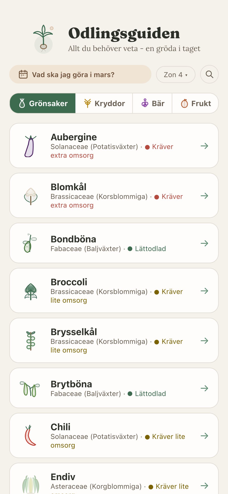
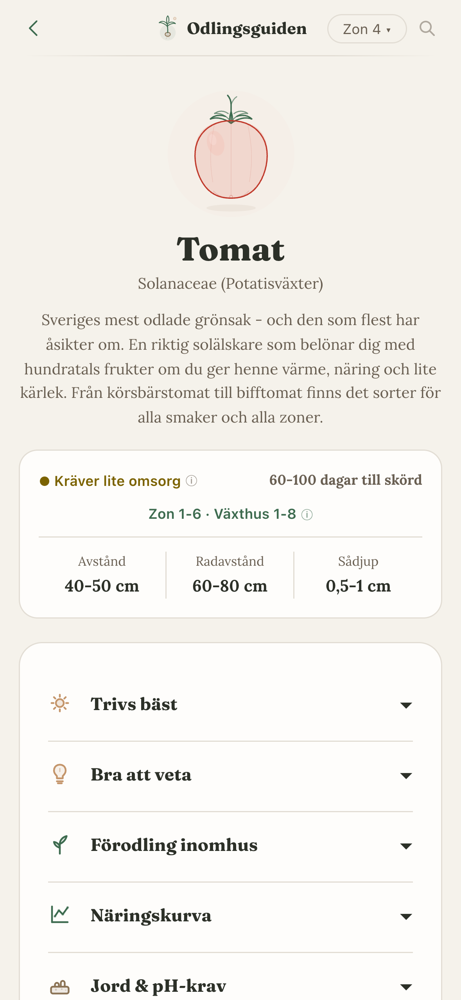

So my wife is a trained gardener. When we moved to our farm outside Kalmar she studied to become one, started growing
vegetables and set up a farm shop. She knows her stuff.

I grew up on a farm too so it's not like I'm lost around plants. But she's on another level. Companion planting, soil
amendments, which crops want what nutrients at what time. I wanted to understand more of that.

## A course about soil

We signed up for a Market Gardening course through Länsstyrelsen in Kalmar. Really good initiative. First session was
great. Second one was online and they started going into soil types and pH values.

Not gonna lie that one wasn't my favourite. But I got the point -- this stuff matters a lot. The problem was that there
was no easy way to look any of it up. What pH does garlic want? What about tomatoes? You'd have to dig through a bunch
of different sources to piece it together.

Then they talked about fertilization. Different nutrients at different stages -- before sowing, during growth, when the
plant is fruiting. Same thing there. Hard to find anything concrete.

That's when the developer brain kicked in. Doesn't that exist? If not can I maybe build something to impress my wife? I
have asked many time if it's something she missing but she always said no. This time I didn't ask. I just built it for
fun and for me because I wanted to learn.

And then it kind of got out of hand.

## One crop became 96

I just wanted a simple guide. Pick a crop, see what it needs. Sowing, spacing, watering, soil, companion plants, common
problems. Adapted for Swedish zones 1-8.

Started sketching and couldn't stop. One crop turned into ten. Ten into fifty. Now there are 96 -- vegetables, berries,
herbs and fruits. All fact-checked against Swedish seed catalogs. Might have overdone it a little.

It runs under our farm [Lilla Bosgården](https://lillabosgarden.se). If it can help us in our growing I guess it can
help others too. Sharing is caring.

## We both find value in it

I already helped with the growing before this but there was a lot I didn't know. Crop rotation for example -- which
crops should follow which, which ones you really should not put next to each other. Didn't have a clue about that
before.

The fun part is my wife uses it too. She finds stuff she didn't know either. It's become a thing for both of us which I
really didn't see coming.

## The vibe of a friend sharing

Every crop has its own tone. Not a textbook, more like a friend telling you how it works. "Basilikan älskar fukt men
HATAR att stå blöt." (Basil loves moisture but HATES wet feet.) My wife helped a lot with getting the tone and growing
details right.

All illustrations are custom SVGs. No emojis, no stock stuff. I care about this maybe too much -- but I think it's
details like this that make it special and really like details like this. It's important for me. Every crop got its own
drawing.

The data part is where the hours go. Sowing depth, spacing, germination temperature, days to harvest, companion plants,
rotation groups, zones, soil, watering, pests. For 96 crops. In Swedish conditions. I now know more about potassium than
I ever thought I would.

## How I built it

Monorepo with three packages. `shared` has all crop data and types, `web` is the Vite + React app, `app` is an Expo
scaffold for a native app later. The idea is that the data lives in one place and everything else just uses it.

The web app prerenders every crop page to static HTML for SEO but acts like a normal React app when you use it. Deployed
through Forge like my other stuff.

All data is TypeScript. No database, no CMS. Each crop is a typed object -- forget a field and the compiler tells you.
New crop? Make a data file, draw an SVG, done.

Went with monorepo early because I want to build a proper app at some point. I really want to release a native app some
day. It will be React Native if so. It's one less language to learn. All the crop data and logic is ready to share when
that happens.

## I had help

70+ sessions with _Claude Code_. Architecture, components, profiles, prerendering -- all of it. I handled content,
design decisions and growing knowledge. Claude handled most of the coding.

It all started as a POC and mockup to see if I could even do it. Then it all escalated from there. But once again I think
this is the kind of project where you can easily get lost in the weeds and never finish without this help.

Most of the time I code alone but since starting to code with Claude it feels like I'm working with a team again.
Something I didn't even know I missed until I had it again.

Honestly without that it would have been ten crops and a list. Instead it turned into something I'm really proud of.

## Check it out

[Odlingsguiden](https://odlingsguiden.se) is live and free. If you grow anything in Sweden hope it can help. The footer
has a feedback button if you spot something off.
