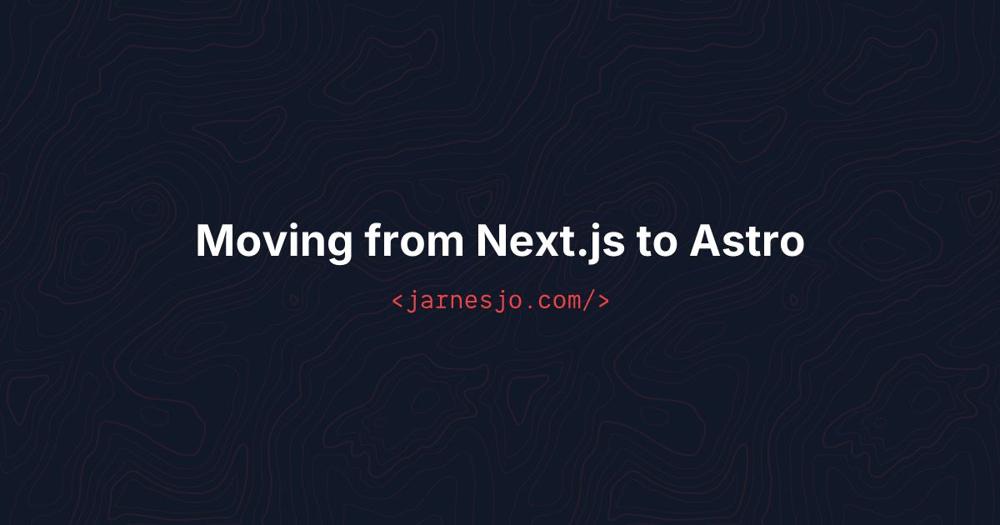

I used to generate OG images with a Puppeteer script. Spin up a headless browser, render some HTML, take a screenshot. It worked but it felt heavy. A whole browser just to make a 1200x630 image.

When I moved this site to Astro I found a much cleaner way. Satori from Vercel converts a JSX-like structure to SVG, and resvg converts that SVG to PNG. No browser, no external service, and it runs as part of the normal Astro build.

This is what the output looks like:



## How it works

Astro has this concept of endpoints -- files that return a Response instead of HTML. If you name the file `[slug].png.ts` inside `src/pages/og/`, Astro generates a PNG file for each slug at build time. Just like it generates HTML pages.

The file exports `getStaticPaths` to define which slugs to generate, and a `GET` function that returns the image data. Same pattern as dynamic pages.

```ts
// src/pages/og/[slug].png.ts
import { getCollection } from 'astro:content'
import { readFileSync } from 'fs'
import { join } from 'path'
import satori from 'satori'
import { Resvg } from '@resvg/resvg-js'

const fontBold = readFileSync(join(process.cwd(), 'src/fonts/Inter-Bold.ttf'))

export async function getStaticPaths() {
  const posts = await getCollection('blog', ({ data }) => data.published !== false)
  return posts.map(post => ({
    params: { slug: post.data.slug },
    props: { title: post.data.title }
  }))
}
```

Each post gets its own `/og/slug.png` file in the build output. No runtime, no API calls. Just static files.

## Satori for the layout

Satori takes a JSX-like object and turns it into SVG. You describe the layout with flexbox and it handles the rest. It's not full CSS -- things like `z-index` don't work -- but for a simple card with text and a background it's more than enough.

```ts
export async function GET({ props }) {
  const { title } = props

  const svg = await satori(
    {
      type: 'div',
      props: {
        style: {
          width: '100%',
          height: '100%',
          display: 'flex',
          flexDirection: 'column',
          justifyContent: 'center',
          alignItems: 'center',
          backgroundColor: '#111827',
          fontFamily: 'Inter'
        },
        children: [
          {
            type: 'div',
            props: {
              style: {
                fontSize: title.length > 60 ? 36 : title.length > 40 ? 44 : 52,
                fontWeight: 700,
                color: '#ffffff',
                textAlign: 'center'
              },
              children: title
            }
          }
        ]
      }
    },
    {
      width: 1200,
      height: 630,
      fonts: [{ name: 'Inter', data: fontBold, weight: 700, style: 'normal' }]
    }
  )

  const resvg = new Resvg(svg, { fitTo: { mode: 'width', value: 1200 } })
  const png = resvg.render().asPng()

  return new Response(png, { headers: { 'Content-Type': 'image/png' } })
}
```

The font size adjusts based on title length so longer titles don't overflow. One thing worth knowing -- Satori needs the actual font file on disk. You can't just reference a Google Font or a CSS import. I have `Inter-Bold.ttf` in `src/fonts/` and read it with `readFileSync`. If you want a custom font in your OG images this is the only way.

## Wiring it up in the layout

The layout picks up the OG image automatically. Each post gets its image URL based on the slug:

```html
---
const metaImage = image
  ? { ...image, src: `${siteUrl}${image.src}` }
  : { src: `${siteUrl}/og/${post.data.slug}.png`, alt: title, width: 1200, height: 630 }
---

<meta property="og:image" content={metaImage.src} />
```

If a post has a custom image in frontmatter it uses that. Otherwise it falls back to the generated one. No configuration needed per post.

## Compared to Puppeteer

With Puppeteer I had a separate script that I ran manually. It needed Chrome installed, took a few seconds per image, and was one more thing to remember before deploying. And honestly I forgot to run it half the time. Posts would go out without OG images because I just didn't think about it.

With this setup the images are just part of the build. Add a new post, run build, done. Nothing to remember, nothing to forget. Each image takes about 170ms to generate. The whole set adds maybe 3 seconds to the build. And it's two dependencies -- `satori` and `@resvg/resvg-js`. No browser needed.

If you're on Astro and you want OG images without the hassle -- this is the way.
