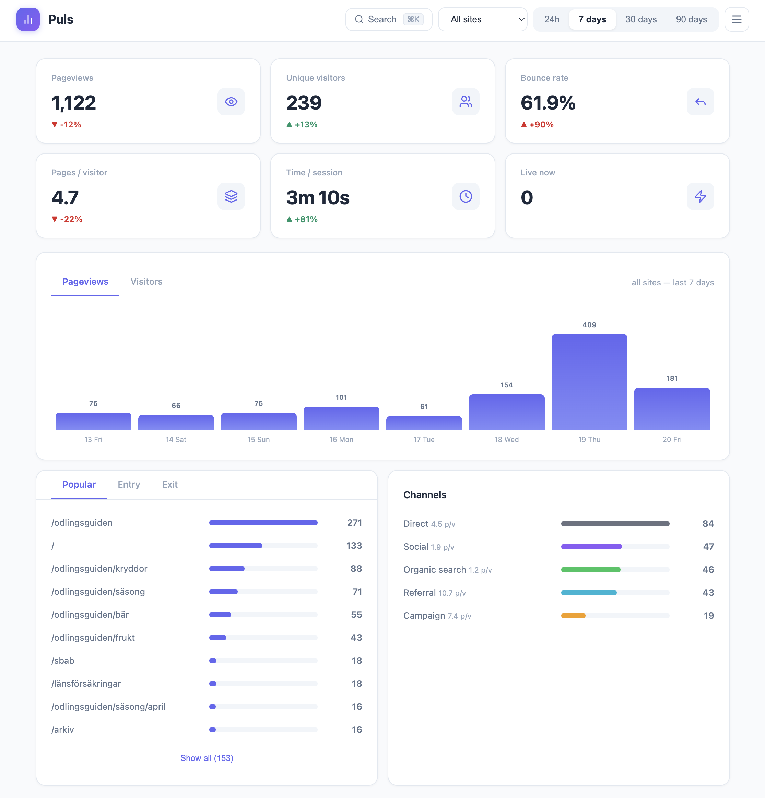
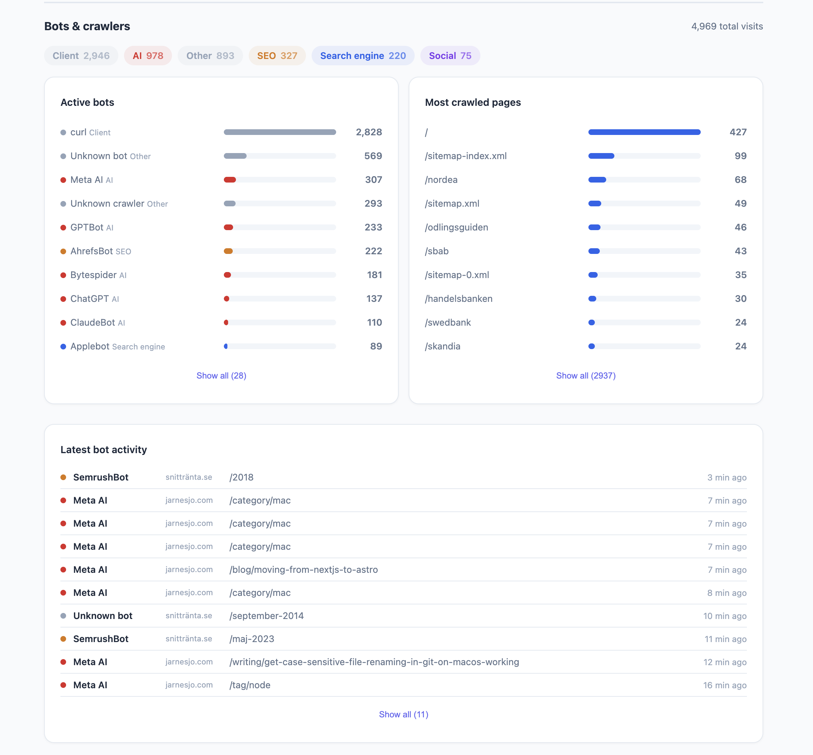

I run a bunch of side projects. Snittränta, Odlingsguiden, this blog, client sites through Webready. Every single one needs some kind of analytics. And every single one had the same annoying problem -- cookie banners.

You know the feeling. You build something clean and fast and then you have to slap a consent dialog on top of it because Google Analytics sets cookies. It always felt wrong. Like putting a speed bump on a race track.

I've been eyeing Fathom for a while. Really like how they've done it -- clean, privacy-first, no cookie banners. But I'm too cheap to pay for it. I try to keep monthly costs as low as possible across all my projects. If I can self-host something on servers I'm already paying for -- that's what I'll do.

So I built Puls.

## Why the name Puls?

The first working name was SimpleStats. It worked but it was boring. I wanted something that felt alive. I went through a bunch of alternatives -- Vigil, Glimpse, Glance, Trace, Signal, Beacon, Ember. Some were too serious, some too poetic, some already taken.

Puls stuck. You're feeling the pulse of your sites. What's happening right now, what's alive, what's dead. It works in both Swedish and English which is a nice bonus when you're building something open source. And there's something fun about giving it a Nordic tone. I'm proud of where I'm from and I like when that shows in the things I build.

## One file. No cookies. Full picture.

That's the tagline and it's not marketing speak -- it's literally how it works. The entire backend is a single PHP file. No framework, no Composer dependencies in production, no build step. Drop it on any PHP 8.2+ host and you're done.

It uses SQLite for storage. The database gets created automatically the first time someone visits your site. No MySQL setup, no migrations to run manually. It just works.

And no cookies. Instead of tracking users with cookies it creates a daily-rotating hash from the visitor's IP and user agent. Same person visiting today gets one hash. Tomorrow they get a different one. You can see how many unique visitors you have today but you can't follow someone across days. That's the whole point -- you get the data you need without being creepy about it.

## What it actually tracks

I didn't want a dumbed-down hit counter. I wanted real analytics but without the privacy trade-off.

Pageviews, unique visitors, bounce rate, session length, pages per visitor. Popular pages, entry pages, exit pages. Traffic channels -- direct, organic search, social, referral, campaign. Full UTM tracking. Browser and device breakdown. All the stuff you actually look at.

And then there's the stuff I built because I needed it myself.

## The Claude Code rabbit hole

I was curious about how bots actually crawl our sites. Like really curious. So while building Puls I asked Claude Code to visit a site we had running in production -- we deployed early to collect real data while developing. I wanted to see if ClaudeBot would show up in the bot detection.

It didn't.

That made me even more curious. Claude Code couldn't tell me what user agent it was using either -- it said it used WebFetch but didn't know the details. So we turned on access logs to find out. Turns out it identifies itself as axios. And it never got caught by the normal bot detection because it doesn't execute JavaScript or load images. It just fetches the HTML and that's it.

That sent us down a rabbit hole. How many other bots work the same way? How much traffic hits your server that you never see in analytics because the bot never runs your tracking script?

The answer is a lot. Way more than most people realize.

So we built a more advanced bot detection layer that works through nginx config. Instead of relying on JavaScript to report bots -- which only works if the bot actually runs your script -- nginx catches them at the server level before they even hit your application. Every request gets logged regardless of whether the bot plays nice or not.

It's an optional feature if you run nginx. But once you turn it on you'll see how much invisible traffic your sites actually get. On some of my sites bots outnumber real visitors. AI crawlers, SEO tools, social scrapers -- they're all there, you just couldn't see them before.

## Broken links find themselves

Another thing I always wanted but never had -- automatic broken link tracking. If someone hits a 404 on your site Puls logs it with the referrer so you know where the bad link is coming from. Same for 301 redirects. You get a list of pages to fix without having to run an external crawler.

## Multi-site from day one

I track all my sites from one Puls installation. Snittränta, Odlingsguiden, jarnesjo.com, client sites -- everything in one dashboard. You can filter by site or see the combined picture. Multi-user support too so clients can log in and see only their sites.

## Paid vs organic

We put Puls on a client site that runs heavy Google Ads and sponsored posts across multiple channels. That turned out to be a great stress test for the traffic channel logic. UTM parameters, Google Ads click IDs, campaign tags -- Puls picks it all up, cleans it and sorts it into the right bucket. Paid, campaign, organic search, social, referral, direct.

The nice part is you can filter the entire dashboard by channel. Click "Paid" and everything updates -- pageviews, bounce rate, popular pages, session length. So you can actually compare how paid traffic behaves versus organic. Are people from Google Ads bouncing more? Do they visit fewer pages? You see it immediately.

## Why PHP

I know. PHP in 2026. But hear me out.

Every cheap hosting provider on earth runs PHP. DigitalOcean, shared hosting, your friend's VPS -- PHP is there. I wanted something anyone could deploy without Docker, without Node, without a CI/CD pipeline. Just upload a file and point your web server at it.

And PHP with SQLite is surprisingly good for this. WAL mode gives you concurrent reads while writes happen. Prepared statements everywhere for security. The whole thing runs fast on minimal resources.

I use Laravel Forge for my own stuff and Puls auto-detects Forge's zero-downtime deploy structure. But it works just as well on Apache with a basic .htaccess.

## It's open source and free

Puls is [MIT licensed on GitHub](https://github.com/webready-se/puls). No paid tier, no "pro" features behind a wall. Everything is right there.

If you're tired of cookie banners and want analytics you actually own -- give it a try. One `php puls key:generate`, one `php puls user:add admin`, and you're tracking.

Check it out, test it on your own sites and come back with ideas and feedback so we can make it better together. This is something I've been missing and I bet you have too.
